# 小可容器云

#### 介绍
小可容器云是一个容器管理平台，基于docker，kubernetes，Jenkins实现从编译构建到部署，简化项目部署流程  
实时监测应用运行状态，提供应用异常记录，异常报警，异常报警推送人等功能

#### 软件架构
后端SpringBoot、mybatis-plus、diboot  jdk 1.8
前端vue、iview  
数据库 mysql 5.7 redis 4.0

#### 系统功能
1. 项目管理
2. 项目人员
3. 命名空间管理
4. kubernetes集群监控、节点信息
5. 用户管理
6. 模板管理
7. 域名管理
8. 应用管理（有状态、无状态）
9. 配置管理
10. 存储管理
11. 应用域名
12. 应用异常记录
13. 报警推送人

#### 系统展示
测试账号  
系统管理员 ：admin  密码：123456  
容器云管理 ：kube  密码：Aa123456@#  
登录

首页
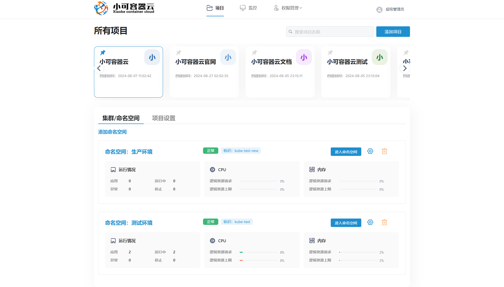
集群监控，节点信息
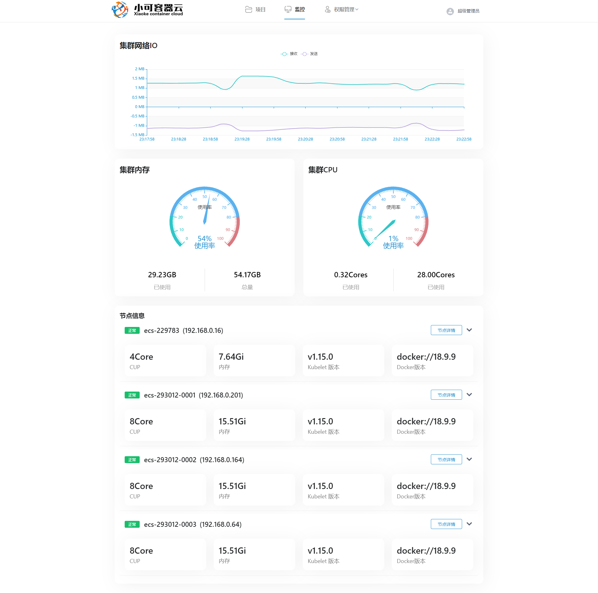
应用列表
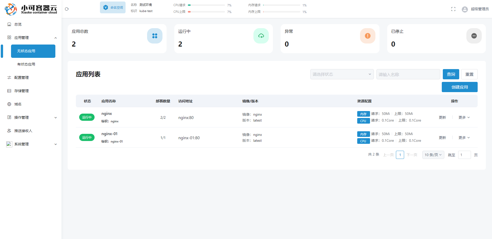

应用详情
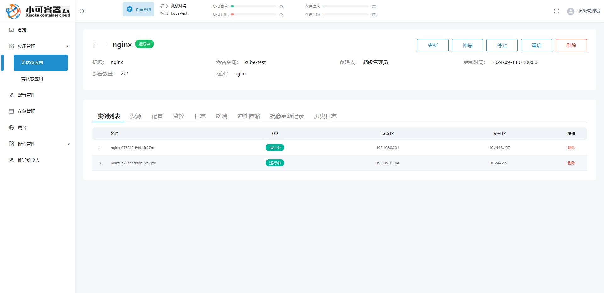
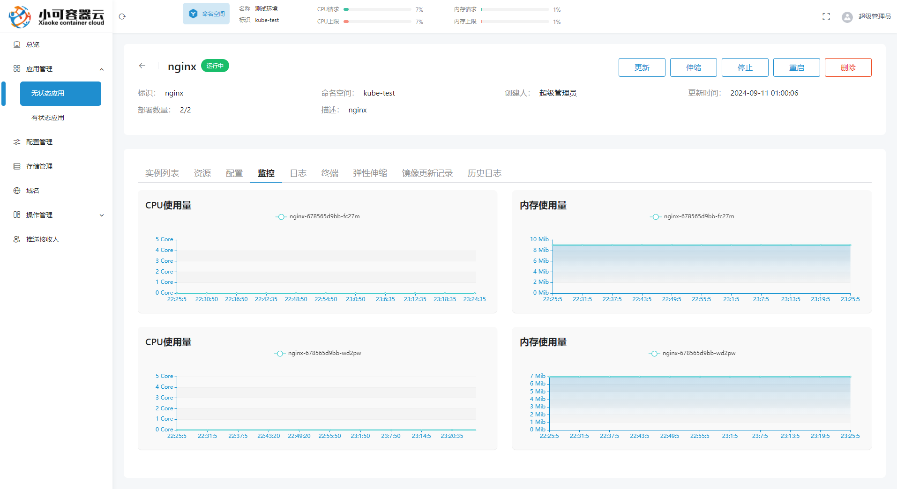
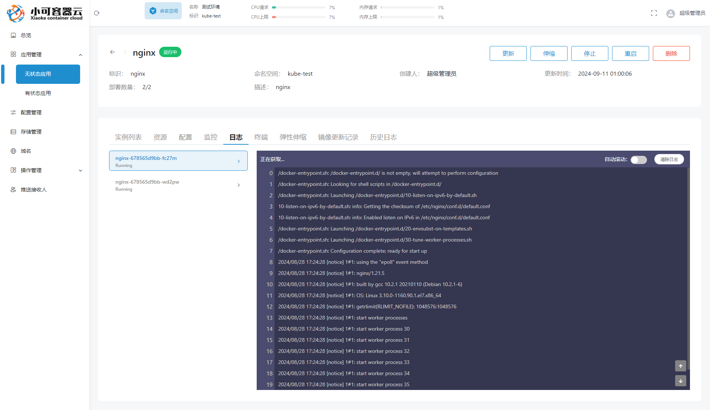
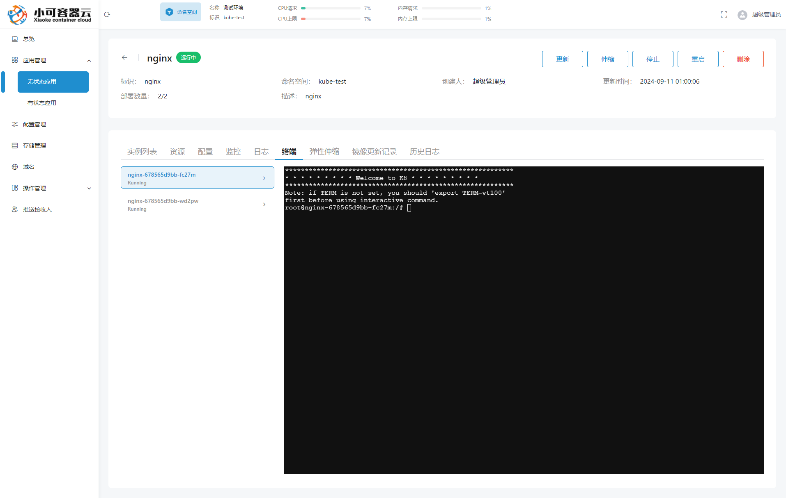

创建应用
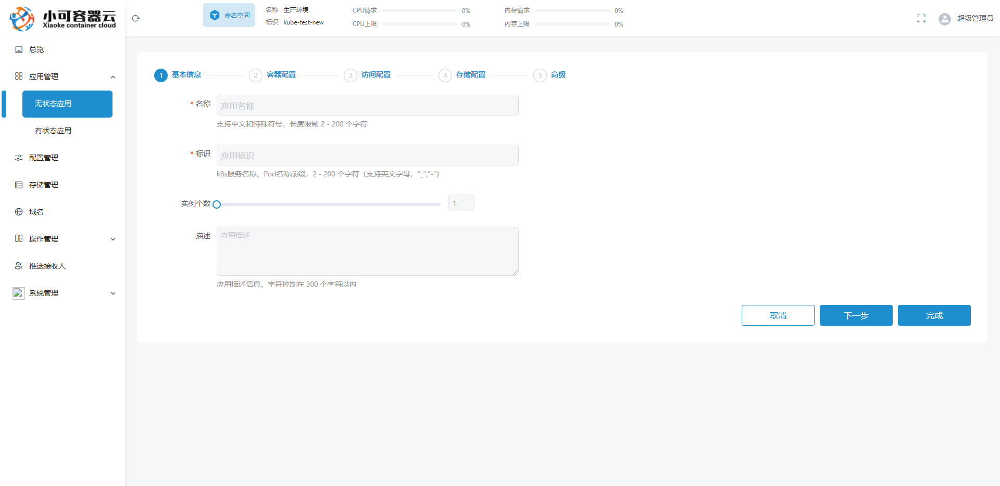
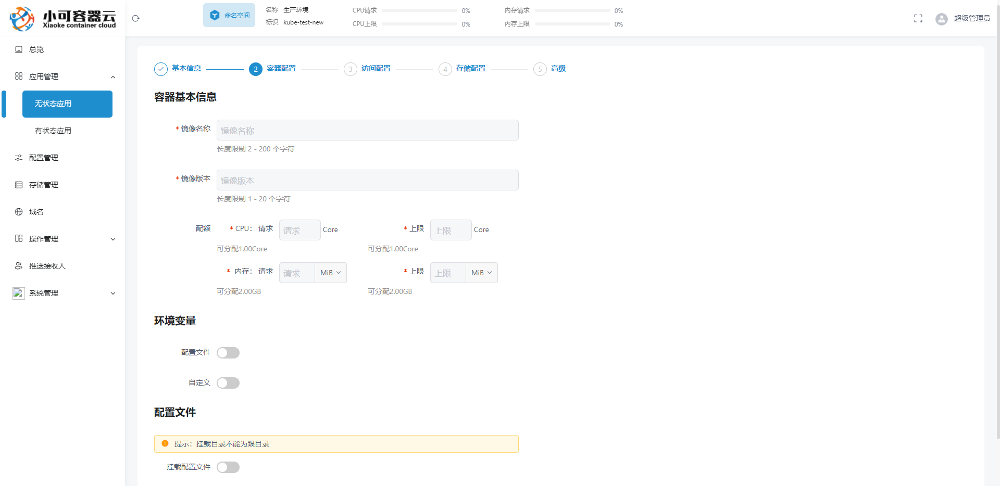
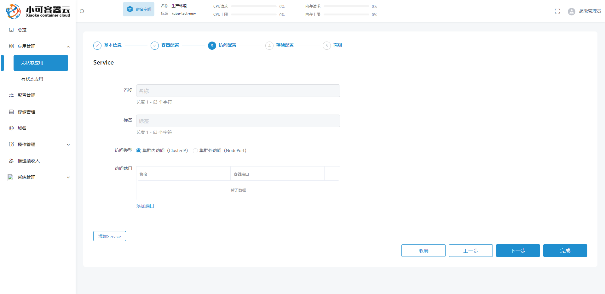
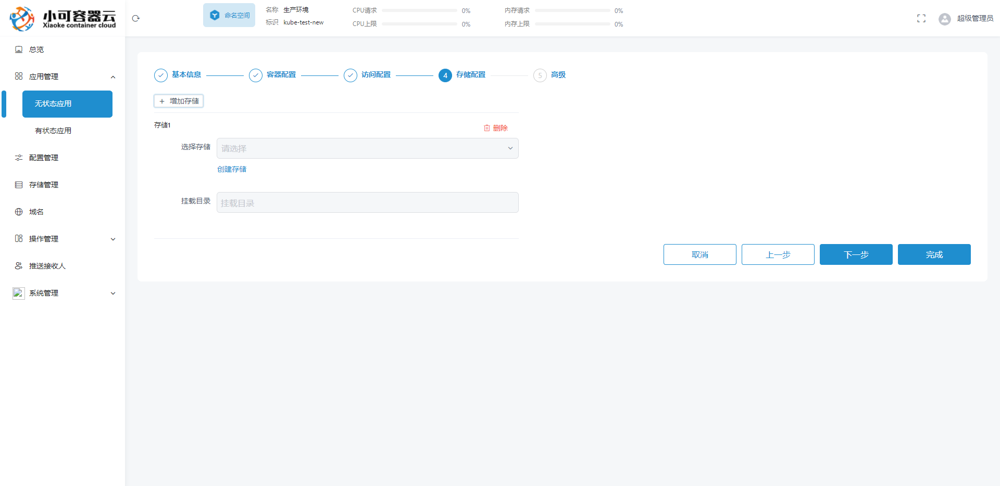
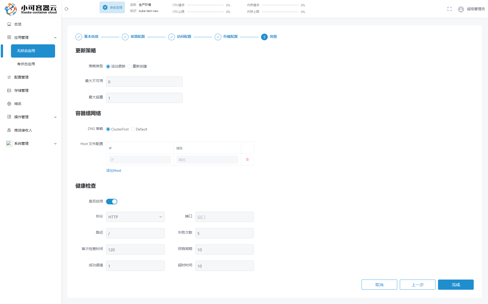

#### 特技

1.  使用 Readme\_XXX.md 来支持不同的语言，例如 Readme\_en.md, Readme\_zh.md
2.  Gitee 官方博客 [blog.gitee.com](https://blog.gitee.com)
3.  你可以 [https://gitee.com/explore](https://gitee.com/explore) 这个地址来了解 Gitee 上的优秀开源项目
4.  [GVP](https://gitee.com/gvp) 全称是 Gitee 最有价值开源项目，是综合评定出的优秀开源项目
5.  Gitee 官方提供的使用手册 [https://gitee.com/help](https://gitee.com/help)
6.  Gitee 封面人物是一档用来展示 Gitee 会员风采的栏目 [https://gitee.com/gitee-stars/](https://gitee.com/gitee-stars/)
